<div align="center">

# 🎁 git-wrapped

### Spotify Wrapped, but for your git history.

**An animated, shareable story of your code — generated 100% locally in one command.**
No account. No API key. No upload. Zero dependencies.

[](https://www.npmjs.com/package/git-wrapped)
[](package.json)
[](LICENSE)
[](package.json)

**`npx git-wrapped`** · run it in any repo · arrows to navigate

</div>

---

> 🎬 *Demo video goes here — record 15 seconds, drag it into a GitHub issue, paste the
> `user-attachments` URL it gives you on this line. See [docs/LAUNCH.md](docs/LAUNCH.md).*

| The story (up to 11 slides) | Every day you showed up |
| --- | --- |
|  |  |
| **Who did the work** | **The verdict** 👏 |
|  |  |

**And the share card** — generated as `wrapped.svg`, made to be embedded in your README:



---

## Why this spreads

Wrapped-style recaps are the most shared format on the internet (Spotify proved it). Every card someone posts — in a README, a tweet, a standup slide — is an ad for the tool. `git-wrapped` is built around that loop:

1. **The story** — `wrapped.html`, a full-screen animated recap of any repo: your heatmap, power hours, language donut, ride-or-die files, commit lingo ("fix" ×321), 3AM commits, and a personality verdict with confetti.
2. **The card** — `wrapped.svg`, a 1200×630 digest. Perfect size for a README *and* for the repo's social preview image. This is the piece that self-propagates: every README it lands in markets the tool to everyone who visits.
3. **The end card** — the story ends with `npx git-wrapped`, so every share teaches the next person how to make their own.

## Quick start

```bash
cd your-project
npx git-wrapped
```

That's it. It writes to `./git-wrapped/`:

| File | What it is |
| --- | --- |
| `wrapped.html` | The animated story. Opens in your browser, `←` `→` / swipe to navigate. |
| `wrapped.svg` | Share card for your README / social preview. |
| `wrapped.json` | The raw stats — do whatever you want with them. |

## Options

```bash
npx git-wrapped [repo-path] [options]

--year 2025        # wrap a single year
--since / --until  # any git date range
--author "name"    # wrap one person's year
--theme synth      # night (default) · synth · forest
--out <dir>        # output elsewhere
--no-open          # don't launch the browser
--json             # stats to stdout, for scripts
```

### Put your year in your profile README (the viral bit)

```bash
npx git-wrapped ~/$YOUR_REPO --year 2025 --no-open
cp $YOUR_REPO/git-wrapped/wrapped.svg .
```

```markdown

```

### Auto-refresh it with GitHub Actions

```yaml
name: wrapped
on:
  schedule: [{ cron: "0 9 1 1 *" }]   # every Jan 1
  workflow_dispatch:
permissions: { contents: write }
jobs:
  wrap:
    runs-on: ubuntu-latest
    steps:
      - uses: actions/checkout@v4
        with: { fetch-depth: 0 }        # full history
      - uses: actions/setup-node@v4
      - run: npx -y git-wrapped . --year $(date -d "last year" +%Y) --no-open --out .
      - run: |
          git config user.name "wrapped-bot" && git config user.email "bot@users.noreply.github.com"
          git add wrapped.svg && git commit -m "wrap: $(date -d 'last year' +%Y)" || exit 0
          git push
```

## What it computes

Everything from one `git log --numstat` pass over your history:

- **Commit volume**, active days, averages, +/− line counts
- **52-week heatmap**, longest streak, current streak, busiest day/month
- **Power-hour clock** (24-hour radial chart) and weekday rhythm
- **Language ranking** by lines written (60+ extensions recognized)
- **Ride-or-die files** by churn
- **Commit lingo** — top verbs, "wip" count, emoji commits, your longest message
- **Ghost hours** — commits between midnight and 5am
- **Your verdict** — one of 9 deterministic coding personalities

## Privacy

Everything runs on your machine with the `git` binary you already have. There is no server, no telemetry, no network call. It reads, it computes, it writes three files. Read the whole source — it's ~1,400 lines with zero dependencies.

## Star history ⭐

If this made you smile, [star the repo](../../stargazers) — it's the only metric that keeps this going.

[](https://star-history.com/#sutharsan-311/git-wrapped&Date)

## Contributing

PRs welcome — verdicts, themes, and languages are all data-driven tables, so adding one is a great first issue.

## License

[MIT](LICENSE) © 2026 sutharsan

<div align="center">
<sub>Built for the people who commit at 3am. 🦉</sub>
</div>
